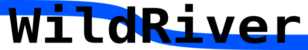

<a href="https://travis-ci.org/dlasalle/wildriver">
  
</a>


<a href="https://ci.appveyor.com/project/dlasalle/wildriver">
  
</a>

<a href='http://wildriver.readthedocs.io/en/latest/?badge=latest'>
  
</a>

Library for reading and writing sparse matrices and graphs.

Full documentation of the API is available at https://wildriver.readthedocs.io.


Examples
--------

How to read in a graph:

```c
#include <wildriver.h>
#include <stdio.h>

int main(
    int argc,
    char ** argv)
{
  if (argc != 2) {
    printf("Need to specify a file name\n");
    return 1;
  }

  char const * const input_file = argv[1];

  uint32_t nvtxs;
  size_t * edgePrefix;
  uint32_t * edgeList;
  double * edgeWeight; 

  rv = wildriver_read_graph(input_file, &nvtxs, NULL, NULL, NULL, \
      &edgePrefix, &edgeList, NULL, &edgeWeight);

  printf("Read graph with %u vertices and %z edges.\n", nvtxs, \
      edgePrefix[nvtxs]);

  free(edgePrefix);
  free(edgeList);
  free(edgeWeight);

  return 0;
}
```

See the `examples/` directory for more usage.

